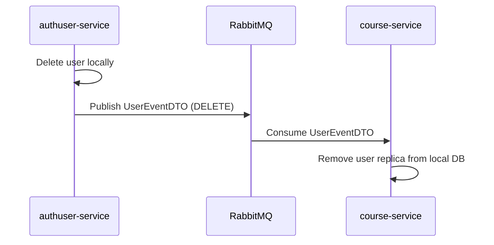

# Course Platform - Microservice Architecture

<div align="center">
  
  
  
  
  
  
  
</div>

<div align="center">
  <p><em>A comprehensive course platform built with microservices architecture, demonstrating enterprise-grade patterns for distributed systems.</em></p>
</div>

---

## 📋 Table of Contents

- [Overview](#-overview)
- [System Architecture](#-system-architecture)
- [Project Microservices](#-project-microservices)
- [Architecture Patterns](#-architecture-patterns)
- [Tech Stack](#-tech-stack)
- [Getting Started](#-getting-started)
- [Contributing](#-contributing)
- [Contact](#-contact)
- [License](#-license)

---

## 🎯 Overview

This project is a **course platform** developed using a **microservice architecture**. The project demonstrates the practical application of various design patterns for distributed systems, focusing on **resilience**, **scalability**, and **maintainability**.

The system is built with **Java 21** and the **Spring Boot 3** / **Spring Cloud** ecosystem.

---

## 🏛️ System Architecture

The architecture is divided into two types of services:

- **Business Services (Core)**: Implement the business rules and core functionalities of the platform, each with its own database.
- **Infrastructure Services (Cross-Cutting)**: Provide the Cross-Cutting Concerns patterns necessary for the communication, configuration, and management of the business services.

---

## 🔧 Project Microservices

### Business Services

| Service | Port | Registry Name (Eureka) | Description |
|---------|------|------------------------|-------------|
| **authuser-service** | 8087 | `course-platform-authuser-service` | Responsible for user management, authentication (login/registration), and authorization. Acts as the central identity service, generating JWT tokens and publishing user events (e.g., `UserEventDTO`). |
| **course-service** | 8082 | `course-platform-course-service` | Manages all logic for courses, modules, lessons, and subscriptions. Consumes events from authuser-service to maintain a local replica of user data and publishes notification commands. |
| **notification-service** | 8084 | `course-platform-notification-service` | Service responsible for consuming notification commands (via `NotificationConsumer.java`) and managing the sending of notifications to users. |

### Infrastructure Services (Spring Cloud)

| Service | Port | Registry Name (Eureka) | Description |
|---------|------|------------------------|-------------|
| **api-gateway** | 8080 | `course-platform-api-gateway` | Single Point of Entry (Façade). Implemented with Spring Cloud Gateway. Routes external requests to internal services using route predicates (e.g., `Path=/course-platform-authuser/**`) and applies load balancing (`uri: lb://...`) integrated with Eureka. |
| **service-registry** | 8761 | `course-platform-service-registry` | Service Discovery (Eureka). Enabled with `@EnableEurekaServer`, it acts as a catalog where all microservices register (`registerWithEureka: true`) and send heartbeats. |
| **config-server** | 8888 | `course-platform-config-server` | Centralized Configuration. Enabled with `@EnableConfigServer`, it exposes the configurations of all services from an external Git repository. |

---

## 🎨 Architecture Patterns

This project practically applies the following architecture concepts:

### Core Patterns Implementation

| Pattern | Implementation | Technical Details |
|---------|----------------|-------------------|
| **Externalized Configuration** | Spring Cloud Config Server | The config-server centralizes the properties of all services in a Git repository. Client services include `spring-cloud-starter-config` and fetch configurations on startup. |
| **Service Discovery** | Netflix Eureka | The service-registry acts as the server (`@EnableEurekaServer`). All services register using `eureka.client.serviceUrl.defaultZone`. |
| **API Gateway (Façade)** | Spring Cloud Gateway | Acts as Façade and Reverse Proxy. Routes use `lb://` prefix with Spring Cloud Load Balancer integrated with Eureka. |
| **Security "Zero Trust"** | Spring Security + JWT | Authentication centralized in authuser-service. Each service validates JWT tokens independently via `AuthenticationJwtFilter.java`. |
| **Circuit Breaker & Retry** | Resilience4j | Protects synchronous calls between services. Policies defined in config-server and applied via `@CircuitBreaker` annotations. |
| **Asynchronous Communication** | RabbitMQ (Spring AMQP) | Distinguishes between **Events** (facts that occurred) and **Commands** (orders). Uses exchanges for decoupling. |
| **Saga Pattern** | Event-Driven Choreography | Distributed transactions managed by event-driven Sagas for **Eventual Consistency**. |
| **Event-Carried State Transfer** | Event DTOs | Events carry complete state to prevent coupling between services. |
| **CAP Theorem** | AP (Availability + Partition Tolerance) | Prioritizes Availability over Strong Consistency, achieving Eventual Consistency through async communication. |

### Saga Pattern Flow Example (User Deletion)



---

## 🛠️ Tech Stack

| Category | Technology | Version | Usage |
|----------|------------|---------|-------|
| **Language** | Java | 21 | Base language of the project |
| **Framework** | Spring Boot | 3.5.x | Main framework for creating services |
| **Microservices** | Spring Cloud | 2025.0.x | Ecosystem (Gateway, Config, Eureka) |
| **Messaging** | RabbitMQ (Spring AMQP) | - | Message Broker for async communication |
| **Resiliency** | Resilience4j | - | Circuit Breaker pattern implementation |
| **Security** | Spring Security | 6.x | Authentication (JWT) and Authorization |
| **JWT** | io.jsonwebtoken (jjwt) | 0.13.x | Token generation and validation |
| **Persistence** | Spring Data JPA | - | Data abstraction layer |
| **Database** | PostgreSQL | - | Relational database for each service |
| **Specifications** | specification-arg-resolver | 3.1.x | Dynamic API filters creation |
| **Build** | Maven | - | Dependency and project build management |

---

## 🚀 Getting Started

### Prerequisites

Before starting the services, ensure you have:

- ✅ **Java 21** and **Maven** installed
- ✅ **PostgreSQL** running and accessible
- ✅ **RabbitMQ** running and accessible
- ✅ **Databases Created**: `course-platform-authuser`, `course-platform-course`, `course-platform-notification`

### Configuration Options

This project uses **Spring Cloud Config** to manage configurations. You have two options:

#### Option 1: Quick Start (Recommended) 🚀

1. Navigate to `src/main/resources/` in each business service
2. Copy `secrets.properties.example` to `secrets.properties`
3. Edit with your local credentials
4. The `application.yaml` imports: `spring.config.import: optional:secrets.properties`

#### Option 2: Production Mode 🏭

1. **Clone the config repository**: [course_platform-config-server-repo](https://github.com/oliver-Victorxavier/course_platform-config-server-repo)
2. **Point config-server** to your clone in `application.yaml`
3. **Replace placeholders** in your cloned config files

### Startup Order

Execute `mvn spring-boot:run` in **this exact order**:

```bash
# 1. Service Registry (wait for http://localhost:8761)
cd service-registry && mvn spring-boot:run

# 2. Config Server (wait until up)
cd config-server && mvn spring-boot:run

# 3. API Gateway
cd api-gateway && mvn spring-boot:run

# 4. Business Services
cd authuser-service && mvn spring-boot:run
cd course-service && mvn spring-boot:run
cd notification-service && mvn spring-boot:run
```

**🎉 Success**: Platform accessible at `http://localhost:8080` via API Gateway!

---

## 🤝 Contributing

Feel free to contribute to this project! Here's how:

### How to Contribute

1. **Fork** the project
2. **Create** a feature branch: `git checkout -b feature/new-feature`
3. **Commit** your changes: `git commit -am 'Add new feature'`
4. **Push** to branch: `git push origin feature/new-feature`
5. **Open** a Pull Request

### Guidelines

- ✅ Add tests for new features
- ✅ Follow project code standards
- ✅ Update documentation when necessary
- ✅ Use semantic commits (`feat:`, `fix:`, `docs:`)

---

## 👨‍💻 Contact

<div align="center">

**Victor Xavier**

[](mailto:victorxavier.oliver@gmail.com)
[](https://www.linkedin.com/in/victor-xavier-/)

</div>

---

## 📄 License

This project is under the **MIT License**. See the [LICENSE](LICENSE) file for more details.

---

<div align="center">
  <p><em>Developed with lots of ☕ by Victor Xavier</em></p>
  
  
</div>
